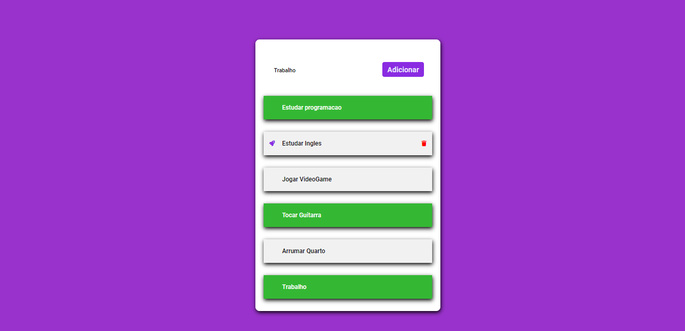

I've created a To Do List to improve my JavaScript skills and i'm pround of it :)

Commit: it saves tasks in the browser storage, so when the page refreshes tasks will stand until get deleted, but there was a problem passing it to GitHub and I had to remove this function

